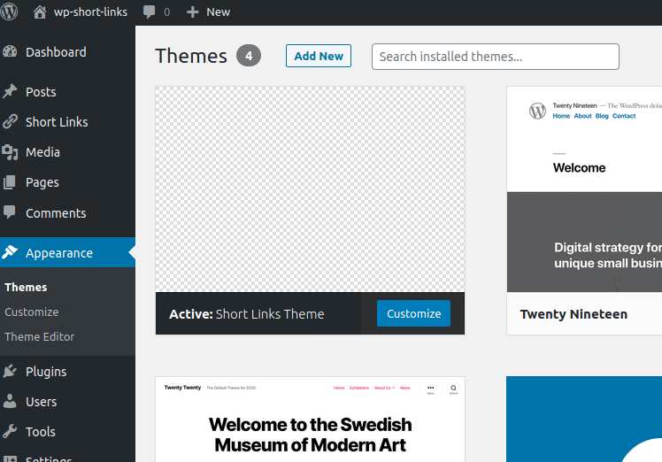
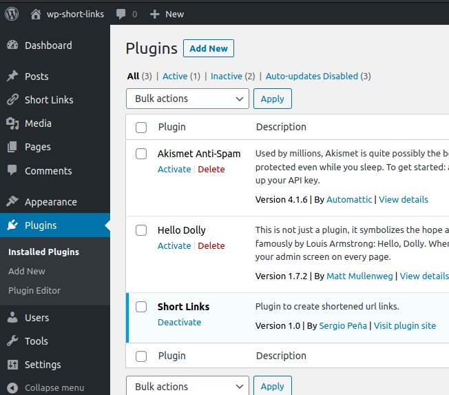
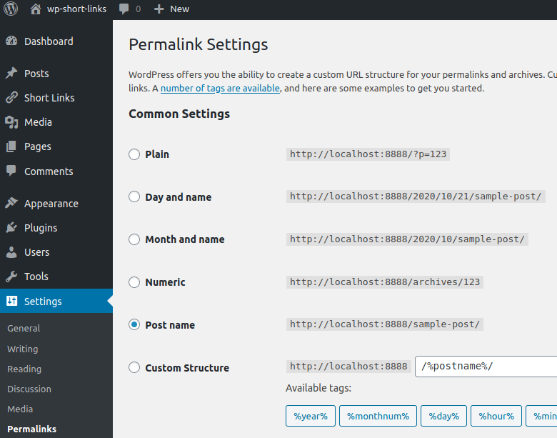
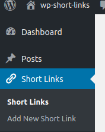
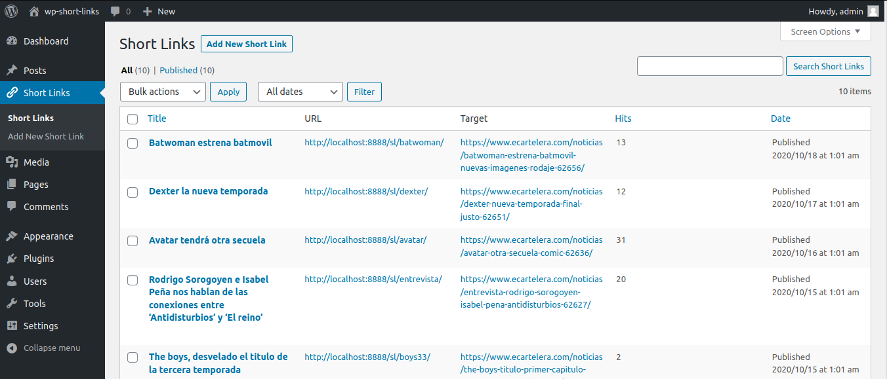
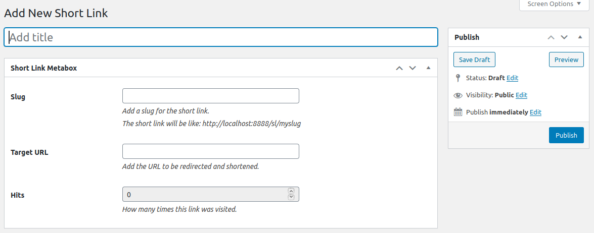
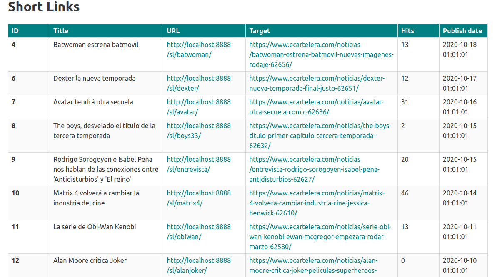

# Short Links

## Instalación y puesta en marcha de WordPress

Para poner en marcha la instalación de WordPress hay que usar el paquete de  `npm` [@wordpress/env](https://developer.wordpress.org/block-editor/packages/packages-env/).

### Prerequisitos

Tener instalados [Docker](https://docs.docker.com/) y [Node.js](https://nodejs.org)

### Instalación

Instalar el paquete de  `npm` [@wordpress/env](https://developer.wordpress.org/block-editor/packages/packages-env/) de manera global:

```bash
$ npm -g i @wordpress/env
```
Ahora ya está disponible el comando `wp-env`.

### Iniciar el entorno local

Después de haber clonado este repositorio, entrar en la carpeta del proyecto e iniciar el entorno, mediante:

```bash
$ cd wp-short-links
$ wp-env start
```

La primera vez puede tardar unos minutos, dependiendo de la conexión a internet. Ya que se tienen que descargar unas imágenes de docker.

Finalmente el sitio de WordPress estará disponible en [http://localhost:8888](http://localhost:8888).

El panel de administración se encuentra en [http://localhost:8888/wp-admin](http://localhost:8888/wp-admin).

El Usuario es `admin` y la contraseña `password`.

### Detener el entorno local

Se detiene con el siguiente comando:

```bash
$ wp-env stop
```

## Activación del tema y del plugin

La primera vez que se entra al panel de administración es necesario activar el tema de WordPress `Short Links Theme`. Entrando en [http://localhost:8888/wp-admin/themes.php](http://localhost:8888/wp-admin/themes.php).



El plugin `Short Links` tambien hay que activarlo, en [http://localhost:8888/wp-admin/plugins.php](http://localhost:8888/wp-admin/plugins.php)



Estas dos operaciones solo hay que hacerlas la primera vez que se ejecuta el entorno local.

## Estructura de permalinks

Es necesario cambiar la Estructura de los permalink. Hay que ponerlo en `Post name` en la siguiente página: [http://localhost:8888/wp-admin/options-permalink.php](http://localhost:8888/wp-admin/options-permalink.php)



## Descripción del proyecto

En esta aplicación los usuarios administradores pueden dar de alta nuevos enlaces acortados eligiendo un `slug` único para cada uno de los enlaces largos. Por ejemplo si el `slug` es `example` se genera la URL corta `http://localhost:8888/sl/example`. Al acceder a esta URL se hace una redirección a la URL destino.

Los usuarios administradores también pueden consultar todos los enlaces acortados que se han dado de alta, asi como ordenarlos de manera ascendente o descendente, en función del título, numero de visitas o fecha de publicación. Las consultas se pueden realizar en la sección `Short Links` del panel.





Para dar de alta un enlace hay que ir al panel de administración en `Short Links -> Add New Short Link` y rellenar el formulario con los campos:

- Title
- Slug
- Target URL



En la parte pública [http://localhost:8888](http://localhost:8888), los usuarios tendrán acceso a una tabla donde pueden visualizar los datos de los enlaces acortados que se han dado de alta. La tabla se puede ordenar de manera ascendente o descendente en función del id, título, url, url destino, visitas o fecha de publicación.



### Backend

El plugin de la carpeta `short-links` se encarga de crear un tipo de post personalizado `shortlink`. A este tipo de post se le añaden los campos personalizados de `shortlink_target_url` y `shortlink_hits`. El campo `slug` es el que viene de manera nativa en cada post de WordPress.

Realiza las redirecciones y contabiliza el número de visitas a los `shotlinks`.

Utiliza la API REST para generar un endpoint donde mostrar públicamente la lista de todos los enlaces cortos. Está disponible en [http://localhost:8888/wp-json/sl/v1/shortlinks/](http://localhost:8888/wp-json/sl/v1/shortlinks/)

Al activarse el plugin por primera vez, se generan unos enlaces de prueba.

### Frontend

Es un tema de WordPress que se encuentra en la carpeta `short-links-theme`.

Básicamente es una SPA o `Single Page Application`, escrita con [Vue.js](https://vuejs.org/) donde se puede interactuar con una tabla que contiene todos los enlaces acortados.

El usuario puede ordenar la tabla de maneras diferentes, haciendo clic en cada una de las cabeceras de la columnas.


## Tests